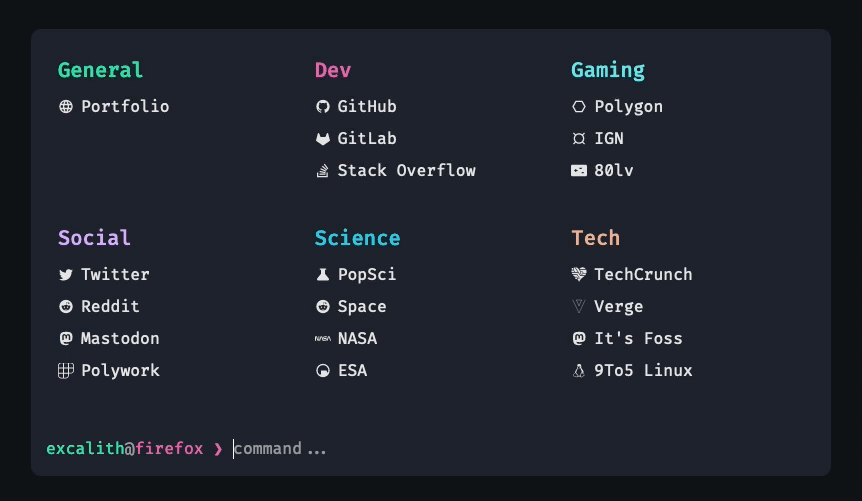

	<h1 align="center">Excalith Start Page</h1>
	

This is an interactive start page for browsers, inspired from my terminal setup.

## Demo

You can explore the working version [here](https://excalith-start-page.vercel.app). To get inspired by community members' configurations, visit the [Showcase](https://github.com/excalith/excalith-start-page/discussions/categories/showcase) in discussions!

> [!IMPORTANT]
> This is a demo version and will be updated regularly, which might break your configurations. It is not recommended for daily browsing. Please refer to the [wiki page](https://github.com/excalith/excalith-start-page/wiki/Getting-Started) for more information.

## Features

- Filter links by typing in the prompt
  - Quickly filter links by typing in the prompt. Hitting <kbd>Enter</kbd> will open all filtered links at once
  - If nothing filtered, the text in prompt will use the default search engine for searching your input
- Launch websites directly from the prompt. Just type the URL (ie. `github.com`)
- Search websites with custom commands. For example, type `s some weird bug` to search StackOverflow for `some weird bug`
- Wallpaper support through URL with blur and fade effects
- Terminal window opacity and translucency effects
- Customizable Fetch UI for fetching browser and system data, including custom image support
- Autosuggest and Autocomplete support just like `zsh` and `fish`
- Cycle through filtered links back and forth
- Multiple theme support (check all [available themes](./data/themes/))
- Built-in configuration editor to easily edit and save your configuration

Please refer to [configuration](https://github.com/excalith/excalith-start-page/wiki/Configuration) page for more information.

### Built-In Commands

- Show usage with `help` command (shows basic usage and your configured search shortcuts)
- Show info with `fetch` command (time, date, system and browser data)
- Update your configuration with `config` command
  - `config help` - Displays config command usage
  - `config import <url>` - Imports a configuration from URL
  - `config theme` - Lists all [available themes](./data/themes/)
  - `config theme <theme-name>` - Switches between themes and sets your local configuration
  - `config edit` - Edit local configuration within editor
  - `config reset` - Reset your configuration to default

### Key Bindings

- Use <kbd>→</kbd> to auto-complete the suggestion
- Search without auto-complete with <kbd>CTRL</kbd> + <kbd>ENTER</kbd>
- Cycle through filtered links using <kbd>TAB</kbd> and <kbd>SHIFT</kbd> + <kbd>TAB</kbd>
- Clear the prompt quickly with <kbd>CTRL</kbd> + <kbd>C</kbd>
- Close windows with <kbd>ESC</kbd>

## Using

There are multiple ways of using this app explained in details on [getting started](https://github.com/excalith/excalith-start-page/wiki/Getting-Started) wiki page. Here is a TLDR:

### Fork

You can fork this repository and have direct control over the source code. This is the best way to customize the start page to your liking. Then you can create *Docker images*, *deploy on your server* or *serve it locally*. Check out the [Fork Wiki Page](https://github.com/excalith/excalith-start-page/wiki/Fork) for more information.

### Docker Image

Using a Docker image is another convenient way to use the start page. You can either use the image from Docker Hub or Github Registry. Currently supports both **amd64** and **arm64** images. Check out the [Docker Wiki Page](https://github.com/excalith/excalith-start-page/wiki/Docker) for more information.

### Online Version
You can use the Online Version (aka. preview version) as well. However, since this is the preview of the project with constant updates, it might break your configurations. I would recommend building your own fork instead. Check out the [Online Version Wiki Page](https://github.com/excalith/excalith-start-page/wiki/Online) for more information.

## Customization

This project, at its heart, supports customization to better suit your desktop environment. There are three methods to personalize the project according to your preferences:

You can either
- **Method 1:** Configure your **fork** by editing [settings.json](./data/settings.json) file
- **Method 2:** Use `config edit` command to edit on the fly, by built-in json editor
- **Method 3:** Use `config import <url>` command to import your remote config file from your dotfiles repository
  
Check out the [Configuration](https://github.com/excalith/excalith-start-page/wiki/Configuration) and [Themes](https://github.com/excalith/excalith-start-page/wiki/Themes) wiki pages for more information regarding themes and configuration options.

## How To Contribute

Please feel free to contribute any way you can. Just keep in mind that you should pay attention to [contributing guideline](.github/CONTRIBUTING.md) before contributing.

## License

The code is available under the [MIT license](LICENSE). Feel free to copy, modify, and distribute the code as you wish, but please keep the original license in the files. Attribution is appreciated and will definetely help improving this project.
