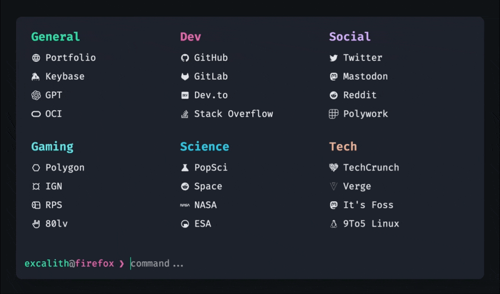

<div align="center">
	<h1 align="center">Excalith Start Page</h1>
	

This is an interactive start page for browsers, inspired from my terminal setup.

[](https://excalith-start-page.vercel.app)
[](https://github.com/excalith/excalith-start-page)
[](https://github.com/excalith/excalith-start-page/pkgs/container/excalith-start-page)
[](https://hub.docker.com/r/excalith/start-page)

</div>

## Demo

You can check the working version from [here](https://excalith-start-page.vercel.app)

> **Warning** This is a demo version and will be updated regularly, which might break your configurations. It is not recommended to use this version for your daily browsing. Please refer to [wiki page](https://github.com/excalith/excalith-start-page/wiki/Getting-Started) for more information.


## Features

- Filter links by typing in the prompt
  - Quickly filter links by typing in the prompt. Hitting <kbd>Enter</kbd> will open all filtered links at once
  - If nothing filtered, the text in prompt will use the default search engine for searching your input
- Launch websites directly from the prompt. Just type the URL (ie. `github.com`)
- Search websites with custom commands. For example, type `s some weird bug` to search StackOverflow for `some weird bug`
- Wallpaper support through URL with blur and fade effects
- Customizable Fetch UI for fetching browser and system data, including custom image support
- Autosuggest and Autocomplete support just like `zsh` and `fish`
- Cycle through filtered links back and forth
- Multiple theme support (check all [available themes](./public/themes/))
- Built-in configuration editor to easily edit and save your configuration

Please refer to [configuration](https://github.com/excalith/excalith-start-page/wiki/Configuration) page for more information.

### Built-In Commands

- Show usage with `help` command (shows basic usage and your configured search shortcuts)
- Show info with `fetch` command (time, date, system and browser data)
- Update your configuration with `config` command
  - `config help` - Displays config command usage
  - `config import <url>` - Import configuration from a URL to your local storage
  - `config theme` - Lists all [available themes](./public/themes/)
  - `config theme <theme-name>` - Switches between themes and sets your local configuration
  - `config edit` - Edit local configuration within editor
  - `config reset` - Reset your configuration to default

### Key Bindings

- Use <kbd>→</kbd> to auto-complete the suggestion
- Cycle through filtered links using <kbd>TAB</kbd> and <kbd>SHIFT</kbd> + <kbd> TAB</kbd>
- Clear the prompt quickly with <kbd>CTRL</kbd> + <kbd>C</kbd>
- Close windows with <kbd>ESC</kbd>


## Using

There are multiple ways of using this app. Here is a quick preview of them. For more information please refer to [getting started](https://github.com/excalith/excalith-start-page/wiki/Getting-Started) page

### Fork

You can fork this repository and have direct control over the source code. This is the best way to customize the start page to your liking.

1. Fork this repository
2. Modify the `startpage.config.js` for the default configuration
3. If you want, you can change the source code to your like as well (optional)
4. Run `yarn dev` command to test it
5. Host locally, create docker image, or deploy to a server

### Docker

Docker is another convenient way to host the start page. You can either use the image from Docker Hub or Github Registry.

<details>
<summary>Using Docker Registry</summary>
<br>

Pull the latest image
```bash
docker pull excalith/start-page:latest
```

Run the image (change the port mapping of 8080 into something you want)
```bash
docker run --name start-page --restart=always -p 8080:3000 -d excalith/start-page
```
</details>

<details>
<summary>Using Github Registry</summary>
<br>

Pull the latest image
```bash
docker pull ghcr.io/excalith/excalith-start-page:latest
```

Run the image (change the port mapping of 8080 into something you want)
```bash
docker run --name start-page --restart=always -p 8080:3000 -d ghcr.io/excalith/excalith-start-page
```
</details>

### Remote Config Import

If you still prefer to use the online version, I would recommend you to use the remote configuration import feature. This feature allows you to import your configuration from a URL. This way, you will always have a backup file of your configuration. Please refer to [getting started](https://github.com/excalith/excalith-start-page/wiki/Getting-Started) page for more information.

## Customization

You can pretty much customize everything! Please refer to [configuration](https://github.com/excalith/excalith-start-page/wiki/Configuration) and [themes](https://github.com/excalith/excalith-start-page/wiki/Themes) pages for more information regarding themes and configuration options.

## How To Contribute

Please feel free to contribute any way you can. Just keep in mind that you should pay attention to [contributing guideline](.github/CONTRIBUTING.md) before contributing.

## License

The code is available under the [MIT license](LICENSE). Feel free to copy, modify, and distribute the code as you wish, but please keep the original license in the files. Attribution is appreciated and will definetely help improving this project.
